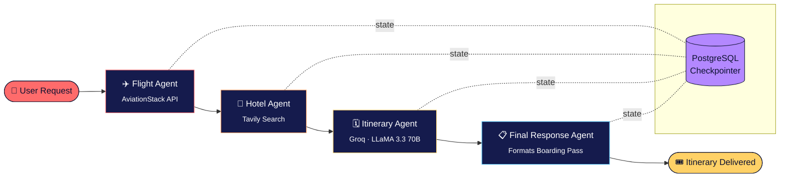

<div align="center">


# Voyagent AI
### Multi-Agent Travel Planner

*Boarding your itinerary, one agent at a time.* 🎫✈️🏨🗓️


<br/>

     

<br/>

[](https://multi-agent-ai-travel-planner-1-u86f.onrender.com)
[](https://github.com/omkar834-droidk/Multi-Agent-AI-Travel-Planner)
[](LICENSE)

</div>

---

## 🌐 Live Demo

<div align="center">

### 🔗 **[multi-agent-ai-travel-planner-1-u86f.onrender.com](https://multi-agent-ai-travel-planner-1-u86f.onrender.com)**

| 🎫 Ask | 🤖 Agents Work | 📄 Get a Boarding Pass |
|:---:|:---:|:---:|
| Type your trip in plain English | Flight → Hotel → Itinerary → Final Agent | Download / copy your full plan |

</div>

---

## 🧭 What is Voyagent AI?

**Voyagent AI** is a multi-agent travel planning system. Give it a one-line request —
*"Plan a 7 day Japan trip from Bangladesh under 2 lakhs"* — and a crew of specialized
AI agents built with **LangGraph** work in sequence to search live flights, pull hotel
recommendations, build a day-by-day itinerary, and format it all into a clean, shareable
**boarding-pass styled itinerary**, downloadable as a PDF.

---

## 🏗️ Architecture



Each agent is a node in a **LangGraph `StateGraph`**, with a **PostgreSQL checkpointer**
persisting conversation state per `thread_id` — so a user can continue refining the same
trip across requests.

---

## 🧰 Tech Stack

<div align="center">

### 🧠 AI / Orchestration


### ⚙️ Backend


### 🗄️ Data & External APIs


### 🎨 Frontend


### ☁️ Deployment


</div>

---

## ✨ Features

- 🤖 **4-agent LangGraph pipeline** — Flight Agent → Hotel Agent → Itinerary Agent → Final Response Agent
- ✈️ **Live flight lookups** via AviationStack, with smart country/city → IATA resolution (`pycountry`, `airportsdata`)
- 🏨 **Hotel & sightseeing research** via Tavily web search
- 🧠 **LLM-generated day-by-day itinerary** using Groq's LLaMA 3.3 70B
- 💾 **Persistent conversation memory** — PostgreSQL-backed LangGraph checkpointer keyed by `thread_id`
- 🎫 **Boarding-pass styled UI** — colorful travel-poster theme, split-flap animated headline
- 🗺️ **Route preview map** with Leaflet.js + OpenStreetMap geocoding
- 📄 **One-click PDF export** and copy-to-clipboard of the final itinerary
- 🔍 **LangSmith tracing** for observability into agent runs

---

## 📂 Project Structure

```
Multi-Agent-AI-Travel-Planner/
├── app.py                  # FastAPI app — routes, static & template mounting
├── backend.py               # LangGraph StateGraph — agents + PostgreSQL checkpointer
├── tools/
│   ├── __init__.py
│   ├── flight_tool.py        # AviationStack integration + IATA resolution
│   └── tavily_tool.py        # Tavily web search wrapper
├── static/
│   ├── style.css              # Voyagent AI colorful UI theme
│   └── script.js               # Frontend logic, map, PDF export
├── templates/
│   └── index.html               # Main UI template
├── .env.example                   # Environment variable template
├── .gitignore
├── .dockerignore
└── README.md
```

---

## ⚙️ Setup & Installation

### 1. Clone the repo
```bash
git clone https://github.com/omkar834-droidk/Multi-Agent-AI-Travel-Planner.git
cd Multi-Agent-AI-Travel-Planner
```

### 2. Create a virtual environment
```bash
python -m venv venv
source venv/bin/activate      # Windows: venv\Scripts\activate
```

### 3. Install dependencies
```bash
pip install -r requirements.txt
```

### 4. Configure environment variables
Create a `.env` file in the project root:

```env
DATABASE_URL=your_postgresql_connection_string
GROQ_API_KEY=your_groq_api_key
AVIATIONSTACK_API_KEY=your_aviationstack_api_key
TAVILY_API_KEY=your_tavily_api_key
DEFAULT_ORIGIN_IATA=DAC

LANGSMITH_TRACING=true
LANGSMITH_ENDPOINT=https://api.smith.langchain.com
LANGSMITH_API_KEY=your_langsmith_api_key
LANGSMITH_PROJECT=travel-agent
```

> ⚠️ Never commit your real `.env` file — keep it listed in `.gitignore` (already included).

### 5. Run the app
```bash
python app.py
```

Visit **http://127.0.0.1:8000** and start planning ✈️

---

## 🖥️ How It Works

1. User types a natural language trip request into the **Request Desk**.
2. `flight_agent` parses the route (city/country → IATA) and queries **AviationStack** for live flight data.
3. `hotel_agent` queries **Tavily** for hotel and sightseeing recommendations.
4. `itinerary_agent` (Groq LLaMA 3.3 70B) drafts a structured day-by-day plan.
5. `final_agent` formats everything into the final **Trip Summary → Flights → Hotels → Itinerary → Budget → Recommendations** response.
6. The frontend renders it as a **boarding pass**, plots a **route map**, and offers **PDF / copy export**.

---

## 🗺️ Roadmap

- [ ] Real fare pricing via Amadeus / Skyscanner API
- [ ] Hotel booking links + price comparison
- [ ] Multi-city itinerary support
- [ ] User accounts & saved trips
- [x] Deploy live demo 🔗

---

## 🧑‍💻 Author

**Omkar Salunke**

[](https://github.com/omkar834-droidk)
[](https://linkedin.com/in/omkar-salunke-712696351)

---

<div align="center">

### ⭐ If you like this project, consider giving it a star!

     

*Built with FastAPI · LangGraph · Groq · PostgreSQL · Tavily · AviationStack*

</div>
