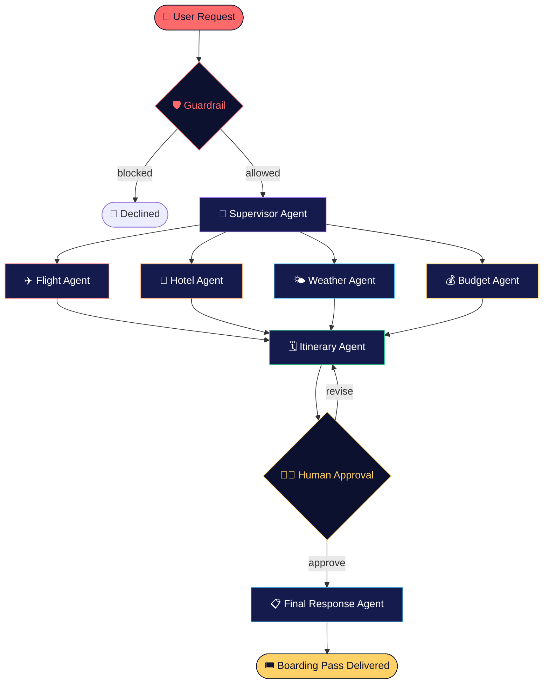

<div align="center">


# Voyagent AI
### Supervisor-Routed Multi-Agent Travel Planner

*Boarding your itinerary, one agent at a time.* 🎫✈️🏨🌤️💰🗓️


<br/>

     

<br/>

[](https://multi-agent-ai-travel-planner-1-u86f.onrender.com)
[](https://github.com/omkar834-droidk/Multi-Agent-AI-Travel-Planner)
[](LICENSE)

</div>

---

## 🌐 Live Demo

<div align="center">

### 🔗 **[multi-agent-ai-travel-planner-1-u86f.onrender.com](https://multi-agent-ai-travel-planner-1-u86f.onrender.com)**

| 🛡️ Guardrail | 🧭 Supervisor Routes | 🤖 Specialists Work | 🧑‍✈️ You Approve | 🎟️ Final Plan |
|:---:|:---:|:---:|:---:|:---:|
| Filters off-topic asks | Picks only needed agents | Flights · Hotels · Weather · Budget | Approve or request changes | Polished boarding pass |

</div>

---

## 🧭 What is Voyagent AI?

Give it one line — **"Plan a 7 day Dubai trip from indai under 2 lakhs"**

1. An **input guardrail** checks the request is genuinely travel-related.
2. A **supervisor agent** decides which specialists the request actually needs.
3. Selected specialists run — **Flight, Hotel, Weather, Budget** — each backed by a live **MCP tool server**.
4. An **itinerary agent** drafts the plan and **pauses for your approval**.
5. You **approve** or **request changes** — the graph resumes from that exact point.
6. A **final agent** issues the polished, boarding-pass styled itinerary.

---

## 🏗️ Architecture


```mermaid
flowchart TD
    A([👤 User Request]) --> B{🛡️ Guardrail}
    B -->|blocked| C([🚫 Declined])
    B -->|allowed| D[🧭 Supervisor Agent]

    D --> E[✈️ Flight Agent]
    D --> F[🏨 Hotel Agent]
    D --> G[🌤️ Weather Agent]
    D --> H[💰 Budget Agent]

    E --> I[🗓️ Itinerary Agent]
    F --> I
    G --> I
    H --> I

    I --> J{🧑‍✈️ Human Approval}
    J -->|revise| I
    J -->|approve| K[📋 Final Response Agent]
    K --> L([🎟️ Boarding Pass Delivered])

    style A fill:#FF6B6B,stroke:#0C1130,color:#0C1130
    style L fill:#FFD166,stroke:#0C1130,color:#0C1130
    style B fill:#0C1130,stroke:#FF6B6B,color:#FF6B6B
    style J fill:#0C1130,stroke:#FFD166,color:#FFD166
    style D fill:#151B4D,stroke:#B388FF,color:#fff
    style E fill:#151B4D,stroke:#FF6B6B,color:#fff
    style F fill:#151B4D,stroke:#FF9F5C,color:#fff
    style G fill:#151B4D,stroke:#4FC3F7,color:#fff
    style H fill:#151B4D,stroke:#FFD166,color:#fff
    style I fill:#151B4D,stroke:#3DDC97,color:#fff
    style K fill:#151B4D,stroke:#4FC3F7,color:#fff
```

Every agent is a node in a **LangGraph `StateGraph`** with **dynamic conditional routing** — only the agents the supervisor picks actually run. A **PostgreSQL checkpointer** persists full state per `thread_id`, which is what lets the human-in-the-loop step genuinely pause and resume later.

---

## 🧠 What Makes This Agentic

- 🔀 **Dynamic routing** — the supervisor only invokes the specialists a request needs, not a fixed chain
- 🛡️ **Guardrailed input** — an LLM checks scope before any specialist runs, with a safe fail-open fallback
- 🔌 **Tool use via MCP** — flights, hotels, and weather come from independent MCP servers, not hardcoded API wrappers
- 🧑‍✈️ **Human-in-the-loop** — the graph pauses after the draft itinerary and waits for a real approve/revise decision
- 💾 **Stateful & resumable** — PostgreSQL checkpointing means a paused run survives restarts

---

## 🧰 Tech Stack

<div align="center">

### 🧠 AI / Orchestration


### ⚙️ Backend


### 🗄️ Data & MCP Servers


### 🎨 Frontend


### ☁️ Deployment


</div>

---

## ✨ Features

- 🛡️ **Input guardrail** — filters off-topic or unsafe requests before any agent runs, with a safe fail-open fallback
- 🧭 **Supervisor agent** — dynamically picks only the specialists needed and extracts structured trip constraints
- ✈️ **Flight Agent** — live flight/airport/airline data via an AviationStack MCP server
- 🏨 **Hotel Agent** — hotel & sightseeing research via a Tavily MCP server
- 🌤️ **Weather Agent** — current conditions + forecast via a custom `FastMCP` OpenWeather server
- 💰 **Budget Agent** — cost breakdown, risk areas, and money-saving suggestions from Groq LLaMA 3.3 70B
- 🗓️ **Itinerary Agent** — drafts a full day-by-day plan from every specialist's output
- 🧑‍✈️ **Human-in-the-loop approval** — approve the draft itinerary or send feedback and it redrafts, looping until you're happy
- 💾 **Resumable, stateful runs** — PostgreSQL-backed LangGraph checkpointer keyed by `thread_id`
- 🤖 **Live agent-trace panel** — the UI shows exactly which agents ran, the supervisor's reasoning, plus dedicated weather & budget cards
- 🎫 **Boarding-pass styled UI** — colorful travel-poster theme, split-flap animated headline, staged pipeline status
- 🗺️ **Route preview map** with Leaflet.js + OpenStreetMap geocoding
- 🔄 **New Plan button** — instantly clears the session thread to start a fresh trip
- 📄 **One-click PDF export** and copy-to-clipboard of the final itinerary
- 🔍 **LangSmith tracing** for full observability into every agent run

---

## 📂 Project Structure

```
Multi-Agent-AI-Travel-Planner/
├── app.py                          # FastAPI app — routes, resume endpoint, static & template mounting
├── backend.py                       # LangGraph StateGraph — supervisor, guardrail, agents, HITL, checkpointer
├── mcp_client.py                     # MultiServerMCPClient — Tavily / AviationStack / Weather MCP wiring
├── custom_weather_mcp_server.py       # FastMCP server — get_current_weather, get_forecast (OpenWeather)
├── static/
│   ├── style.css                       # Voyagent AI colorful UI theme + agent-trace & approval styles
│   └── script.js                        # Frontend logic — map, HITL approval flow, agent trace, PDF export
├── templates/
│   └── index.html                        # Main UI template
├── .env.example                            # Environment variable template
├── .gitignore
├── .dockerignore
└── README.md
```

---

## ⚙️ Setup & Installation

### 1. Clone the repo
```bash
git clone https://github.com/omkar834-droidk/Multi-Agent-AI-Travel-Planner.git
cd Multi-Agent-AI-Travel-Planner
```

### 2. Create a virtual environment
```bash
python -m venv venv
source venv/bin/activate      # Windows: venv\Scripts\activate
```

### 3. Install dependencies
```bash
pip install -r requirements.txt
```

You'll also need [`uv`](https://docs.astral.sh/uv/) installed (`uvx`), since the AviationStack MCP server runs as a `uvx`-launched subprocess.

### 4. Configure environment variables
Create a `.env` file in the project root:

```env
DATABASE_URL=your_postgresql_connection_string

GROQ_API_KEY=your_groq_api_key
TAVILY_API_KEY=your_tavily_api_key
AVIATION_STACK_API_KEY=your_aviationstack_api_key
OPENWEATHER_API_KEY=your_openweather_api_key

LANGSMITH_TRACING=true
LANGSMITH_ENDPOINT=https://api.smith.langchain.com
LANGSMITH_API_KEY=your_langsmith_api_key
LANGSMITH_PROJECT=travel-agent
```

> ⚠️ Never commit your real `.env` file — keep it listed in `.gitignore` (already included).

### 5. Run the app
```bash
python app.py
```

Visit **http://127.0.0.1:8000** and start planning ✈️

---

## 🖥️ How It Works

1. The **input guardrail** confirms the request is genuine travel-planning content.
2. The **supervisor agent** parses trip constraints and picks the specialists it needs.
3. Specialists run against live MCP tools: `flight_agent` → AviationStack MCP, `hotel_agent` → Tavily MCP, `weather_agent` → the custom OpenWeather MCP server.
4. `budget_agent` (Groq LLaMA 3.3 70B) analyzes cost feasibility against whatever results are available.
5. `itinerary_agent` drafts a day-by-day plan and the graph **pauses** for your review.
6. You **approve** it, or send **revision feedback** — it loops back through the itinerary agent and pauses again.
7. `final_agent` formats the approved plan into the polished **Trip Summary → Flights → Hotels → Weather → Day-by-Day Itinerary → Budget → Recommendations** response.
8. The frontend renders the **agent-trace panel**, a **boarding pass**, a **route map**, and offers **PDF / copy export**.

---

## 🧑‍💻 Author

**Omkar Salunke**

[](https://github.com/omkar834-droidk)
[](https://linkedin.com/in/omkar-salunke-712696351)

---

<div align="center">

### ⭐ If you like this project, consider giving it a star!

*Built with FastAPI · LangGraph · MCP · Groq · PostgreSQL · Tavily · AviationStack · OpenWeather*

</div>
